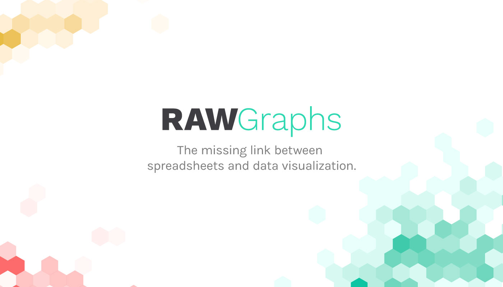

## About

**RAWGraphs** is an open web tool to create custom vector-based visualizations on top of the amazing [d3.js](https://github.com/mbostock/d3) library by [Mike Bostock](http://bost.ocks.org/mike/).
It has been developed by [DensityDesign Research Lab](http://www.densitydesign.org/) ([Politecnico di Milano](http://www.polimi.it/)) and [Calibro](http://calib.ro/), and sustained through a corporate stewardship by [ContactLab](http://contactlab.com/it/).

Primarily conceived as a tool for designers and vis geeks, RAWGraphs aims at providing a missing link  between spreadsheet applications (e.g. Microsoft Excel, Apple Numbers, Google Docs, OpenRefine, …) and vector graphics editors (e.g. Adobe Illustrator, Inkscape, …).

RAWGraphs works with [tabular data](https://en.wikipedia.org/wiki/Table_(information)) (e.g. spreadhseets and comma-separated values) as well as with copied-and-pasted texts from other applications (e.g. Microsoft Excel, TextWrangler, TextEdit, …). Based on the [SVG](http://en.wikipedia.org/wiki/Svg) format, visualizations can be easily edited with vector graphics applications for further refinements, or directly embedded into web pages.

Knowing the need of working with sensitive information, the data injected into RAWGraphs is processed only by the web browser: **no server-side operations or storages are performed** and no one will see, touch or copy your data!

RAWGraphs is also highly customizable and extensible, accepting new custom layouts defined by users. For more information about how to add or edit layouts, see the [Developer Guide](https://github.com/densitydesign/raw/wiki/Developer-Guide).

- App page: [app.rawgraphs.io](http://app.rawgraphs.io)
- Project official page: [rawgraphs.io](http://rawgraphs.io)
- Documentation: [github.com/densitydesign/raw/wiki](https://github.com/densitydesign/raw/wiki)
- Google group: [groups.google.com/forum/#!forum/densitydesign-raw](https://groups.google.com/forum/#!forum/densitydesign-raw)


## Usage
The easiest way to use RAWGraphs is by accessing the most updated version on the **[official app page](http://app.rawgraphs.io)**. However, RAWGraphs can also run locally on your machine: see the installation instructions below to know how.

## Installation
If you want to run your instance of RAWGraphs locally on your machine, be sure you have the following requirements installed.

### Requirements

- [git](http://git-scm.com/book/en/Getting-Started-Installing-Git)
- [Bower](http://bower.io/#installing-bower)

### Instructions

Clone RAWGraphs from the command line:

``` sh
$ git clone https://github.com/densitydesign/raw.git
```

browse to RAWGraphs root folder:

``` sh
$ cd raw
```

install client-side dependencies:

``` sh
$ bower install
```

add analytics script:

``` sh
$ cp js/analytics.sample.js js/analytics.js
```

open the file ```js/analytics.js``` and add your analytics code (if any), otherwise leave the file as is.

You can now run RAWGraphs from your local web server. For example, you can run Python's built-in server:

``` sh
$ python -m SimpleHTTPServer 4000
```

or for Python 3+

``` sh
$ python -m http.server 4000
```

Once this is running, go to [http://localhost:4000/](http://localhost:4000/).

Troubles with the installation? Maybe a look at the [issues](https://github.com/densitydesign/raw/issues) page can solve your problem, otherwise join the [Google group](https://groups.google.com/forum/#!forum/densitydesign-raw).


## Documentation and Support

Documentation and FAQs about how to use RAWGraphs can be found on the [wiki](https://github.com/densitydesign/raw/wiki/).

## Charts

Information about the available charts can be found [here](https://github.com/densitydesign/raw/wiki/Available-Charts). Adding new charts is very easy in RAWGraphs, see how [here](https://github.com/densitydesign/raw/wiki/Adding-New-Charts)!

If you have any suggestion or request about new layouts to include, please let us know! If you have already created new charts and you would like to see them included into Raw, please send us a [pull request](https://github.com/densitydesign/raw/pulls).

## Libraries

**RAWGraphs** has been developed using a lot of cool stuff found out there:

[angular.js](https://github.com/angular/angular.js)

[angular-bootstrap-colorpicker](https://github.com/buberdds/angular-bootstrap-colorpicker)

[angular-ui](https://github.com/angular-ui)

[bootstrap](https://github.com/twbs/bootstrap)

[bootstrap-colorpicker](http://www.eyecon.ro/bootstrap-colorpicker/)

[Bower](https://github.com/bower/bower)

[canvas-toBlob.js](https://github.com/eligrey/canvas-toBlob.js)

[CodeMirror](https://github.com/marijnh/codemirror)

[d3.js](https://github.com/mbostock/d3)

[d3-legend](https://github.com/susielu/d3-legend)

[FileSaver.js](https://github.com/eligrey/FileSaver.js)

[is.js](http://is.js.org/)

[jQuery](https://github.com/jquery/jquery)

[jQuery UI Touch Punch](https://github.com/furf/jquery-ui-touch-punch/)

[NG file upload](https://github.com/danialfarid/ng-file-upload)

[Sheet JS](https://github.com/SheetJS)

[ZeroClipboard](https://github.com/zeroclipboard/zeroclipboard)

## Core Team

**RAWGraphs** is maintained by [DensityDesign Research Lab](http://www.densitydesign.org/) and [Calibro](http://calib.ro/).

If you want to know more about RAWGraphs, how it works and future developments, please visit the [official website](http://rawgraphs.io). For any specific request or comment we suggest you to use Github or the [Google group](https://groups.google.com/forum/#!forum/densitydesign-raw). If none of these worked for you, you can write us at <hello@rawgraphs.io>.

## Contributing

Want to contribute to RAWGraphs's development? You are more than welcome! Start by forking the repository (the "Fork" button at the top-right corner of this page) and follow the instructions above to clone it and install dependencies. Then you can use Github's issues and pull requests to discuss and share your work.
You will need to sign a [Contributor License Agreement (CLA)](https://en.wikipedia.org/wiki/Contributor_License_Agreement) before making a submission. We adopted CLA to be sure that the project will remain open source. For more information, write us: <hello@rawgraphs.io>.

## Publications / Citing RAWGraphs
If you have found RAWGraphs useful in your research, or if you want to reference it in your work, please consider to cite the paper we presented at [CHItaly 2017](http://sites.unica.it/chitaly2017/).

you can read the full article in Green Open Access at the following link:

 [RAWGraphs: A Visualisation Platform to Create Open Outputs](http://rawgraphs.io/about/#cite)

Cite RAWGraphs:

> Mauri, M., Elli, T., Caviglia, G., Uboldi, G., & Azzi, M. (2017). RAWGraphs: A Visualisation Platform to Create Open Outputs. In *Proceedings of the 12th Biannual Conference on Italian SIGCHI Chapter* (p. 28:1–28:5). New York, NY, USA: ACM. https://doi.org/10.1145/3125571.3125585

Bibtex:
```
@inproceedings{Mauri:2017:RVP:3125571.3125585,
 author = {Mauri, Michele and Elli, Tommaso and Caviglia, Giorgio and Uboldi, Giorgio and Azzi, Matteo},
 title = {RAWGraphs: A Visualisation Platform to Create Open Outputs},
 booktitle = {Proceedings of the 12th Biannual Conference on Italian SIGCHI Chapter},
 series = {CHItaly '17},
 year = {2017},
 isbn = {978-1-4503-5237-6},
 location = {Cagliari, Italy},
 pages = {28:1--28:5},
 articleno = {28},
 numpages = {5},
 url = {http://doi.acm.org/10.1145/3125571.3125585},
 doi = {10.1145/3125571.3125585},
 acmid = {3125585},
 publisher = {ACM},
 address = {New York, NY, USA},
 keywords = {Visualization tools, data visualization, open output, visual interface},
}
```

## Authors
**RAWGraphs** has been originally developed by:

* Giorgio Caviglia <giorgio.caviglia@gmail.com>
* Michele Mauri <mikimauri@gmail.com>
* Giorgio Uboldi <giorgio@calib.ro>
* Matteo Azzi <matteo@calib.ro>

## License

RAWGraphs is provided under the [Apache License 2.0](https://github.com/densitydesign/raw/blob/master/LICENSE):

	Copyright (c), 2013-2017 DensityDesign Lab, Giorgio Caviglia, Michele Mauri, Giorgio Uboldi, Matteo Azzi
	
	<info@densitydesign.org>
	<giorgio.caviglia@gmail.com>
	<mikimauri@gmail.com>
	<giorgio@calib.ro>
	<matteo@calib.ro>
	
	Licensed under the Apache License, Version 2.0 (the "License"); you may not use this file except in compliance with the License.
	You may obtain a copy of the License at
	
		http://www.apache.org/licenses/LICENSE-2.0
	
	Unless required by applicable law or agreed to in writing, software distributed under the License is distributed on an "AS IS" BASIS, WITHOUT WARRANTIES OR CONDITIONS OF ANY KIND, either express or implied.
	See the License for the specific language governing permissions and limitations under the License.
